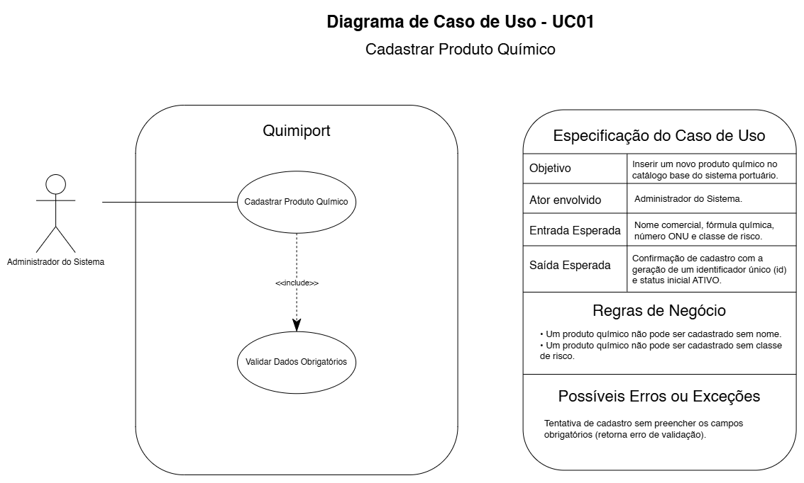

# UC01 — Cadastrar Produto Químico

## Objetivo

Inserir um novo Produto Químico no catálogo base do sistema portuário.

## Ator envolvido

Administrador do Sistema.

## Entrada esperada

- nome comercial;
- fórmula química;
- Número ONU;
- classe de risco.

## Saída esperada

Cadastro confirmado com geração de identificador único e status inicial `ATIVO`.

## Principais regras de negócio

- Produto Químico não pode ser cadastrado sem nome.
- Produto Químico não pode ser cadastrado sem classe de risco.

## Possíveis erros ou exceções

- **E1:** campos obrigatórios ausentes.
