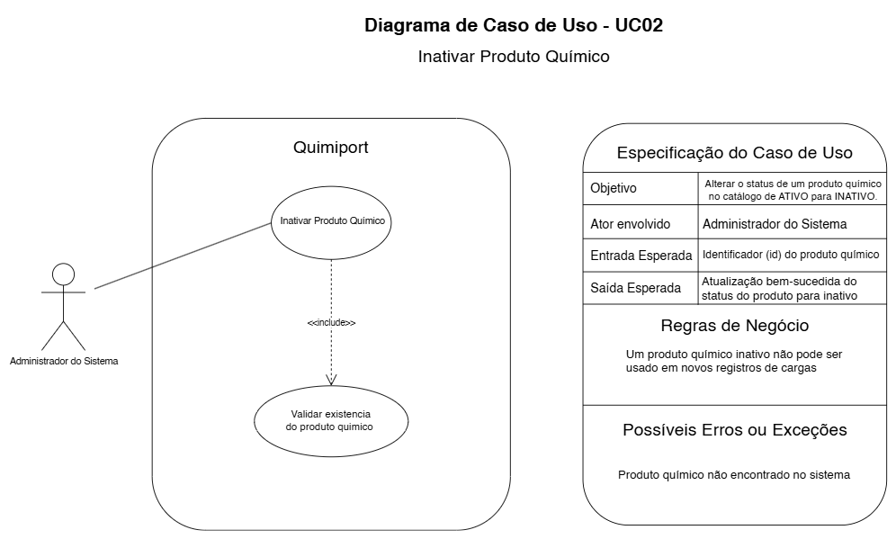

# UC02 — Inativar Produto Químico

## Objetivo

Alterar o status do Produto Químico de `ATIVO` para `INATIVO`.

## Ator envolvido

Administrador do Sistema.

## Entrada esperada

Identificador do Produto Químico.

## Saída esperada

Status atualizado para `INATIVO`.

## Principais regras de negócio

- Produto Químico inativo não pode ser utilizado em novas cargas.

## Possíveis erros ou exceções

- **E1:** Produto Químico não encontrado.
