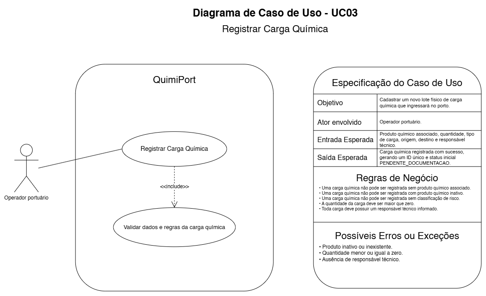

# UC03 — Registrar Carga Química

## Objetivo

Cadastrar um novo lote físico de Carga Química que ingressará no porto.

## Ator envolvido

Operador Portuário.

## Entrada esperada

- Produto Químico associado;
- quantidade;
- tipo de carga;
- origem;
- destino;
- Responsável Técnico.

## Saída esperada

Carga registrada com ID único e status inicial `PENDENTE_DOCUMENTACAO`.

## Principais regras de negócio

- Produto Químico associado é obrigatório.
- Produto Químico deve estar ativo.
- Classificação de risco é obrigatória.
- Quantidade deve ser maior que zero.
- Responsável Técnico é obrigatório.

## Possíveis erros ou exceções

- **E1:** Produto Químico inexistente ou inativo.
- **E2:** quantidade menor ou igual a zero.
- **E3:** ausência de Responsável Técnico.
