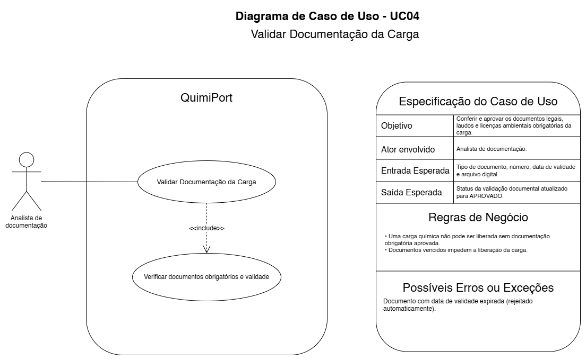

# UC04 — Validar Documentação da Carga

## Objetivo

Conferir e aprovar documentos legais, laudos e licenças ambientais obrigatórias da carga.

## Ator envolvido

Analista de Documentação.

## Entrada esperada

- tipo de documento;
- número;
- data de validade;
- arquivo digital.

## Saída esperada

Status da **validação documental** atualizado para `APROVADO`.

> `APROVADO` é um estado da validação do documento e não um status do ciclo de vida da Carga Química.

## Principais regras de negócio

- Carga não pode ser liberada sem documentação obrigatória aprovada.
- Documentos vencidos impedem a liberação.

## Possíveis erros ou exceções

- **E1:** documento com validade expirada.
