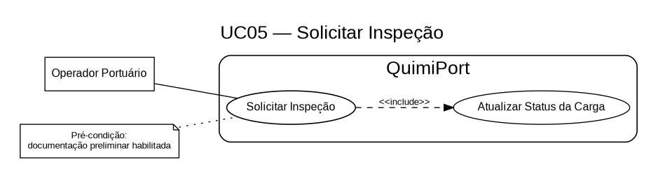

# UC05 — Solicitar Inspeção

## Objetivo

Requerer a vistoria física ou documental da carga.

## Ator envolvido

Operador Portuário.

## Entrada esperada

- identificador da carga;
- observações iniciais.

## Saída esperada

Solicitação de inspeção registrada e, após validação das pré-condições, status da carga atualizado para `EM_INSPECAO`.

## Principais regras de negócio

- A carga deve possuir documentação preliminar habilitada antes da solicitação da inspeção.
- Carga bloqueada ou cancelada não pode entrar nesse fluxo.

## Possíveis erros ou exceções

- **E1:** carga bloqueada ou cancelada.

> O Analista de Qualidade / Segurança não solicita a inspeção. Sua responsabilidade está no caso de uso **UC05B — Validar Inspeção**.
