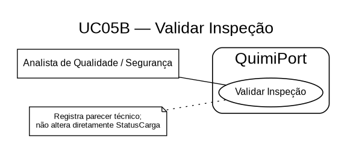

# UC05B — Validar Inspeção

## Objetivo

Registrar o resultado da inspeção e o parecer técnico sobre a Carga Química.

## Ator envolvido

Analista de Qualidade / Segurança.

## Entrada esperada

- identificador da carga/inspeção;
- parecer técnico;
- observações.

## Saída esperada

Inspeção validada e parecer técnico registrado.

## Principais regras de negócio

- A liberação de uma carga em inspeção exige parecer favorável.
- O parecer da inspeção pertence à entidade `Inspecao`; ele não cria, por si só, um novo status da Carga Química.

## Possíveis erros ou exceções

- **E1:** inspeção ou carga não encontrada.
