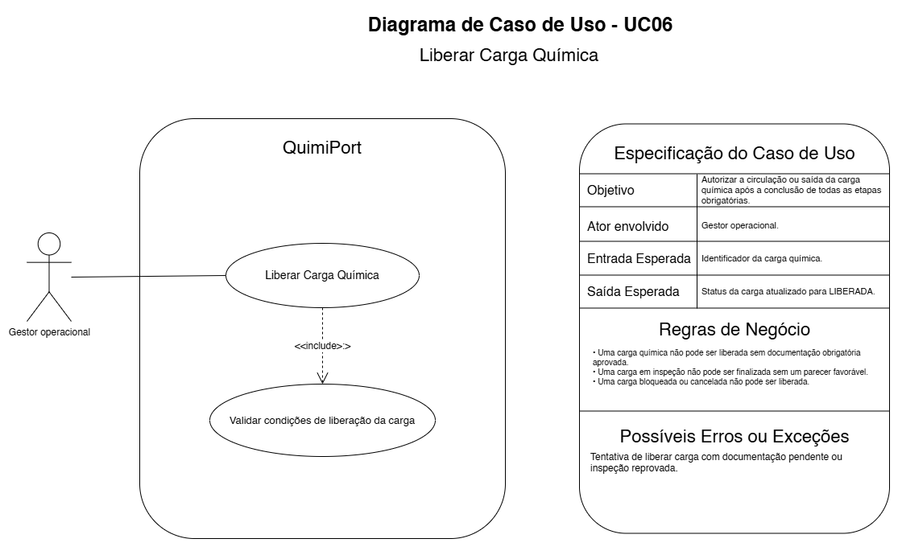

# UC06 — Liberar Carga Química

## Objetivo

Autorizar a circulação ou saída da carga após a conclusão das etapas obrigatórias.

## Ator envolvido

Gestor Operacional.

## Entrada esperada

Identificador da Carga Química.

## Saída esperada

Status atualizado para `LIBERADA`.

## Principais regras de negócio

- Documentação obrigatória deve estar aprovada e válida.
- Inspeção deve possuir parecer favorável.
- Carga bloqueada ou cancelada não pode ser liberada.

## Possíveis erros ou exceções

- **E1:** documentação pendente ou inspeção reprovada.
