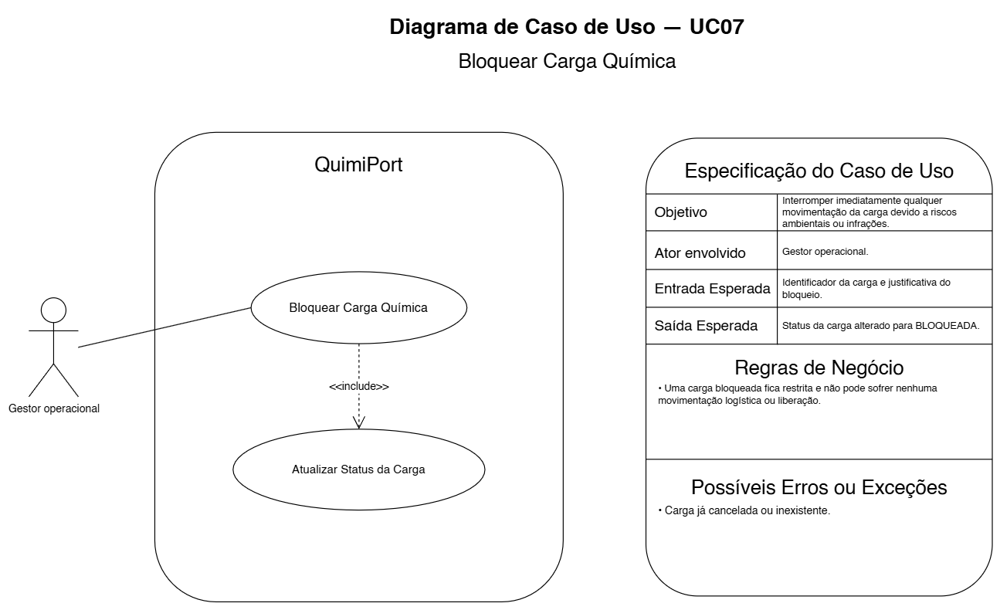

# UC07 — Bloquear Carga Química

## Objetivo

Interromper a movimentação da carga devido a riscos ambientais ou infrações.

## Ator envolvido

Gestor Operacional.

## Entrada esperada

- identificador da carga;
- justificativa do bloqueio.

## Saída esperada

Status alterado para `BLOQUEADA`.

## Principais regras de negócio

- Carga bloqueada não pode sofrer movimentação logística ou liberação.

## Possíveis erros ou exceções

- **E1:** carga cancelada ou inexistente.
