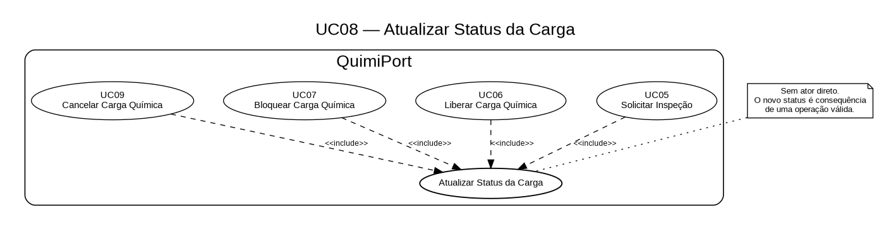

# UC08 — Atualizar Status da Carga

## Objetivo

Atualizar internamente o estado da carga quando uma operação válida provocar uma transição em seu ciclo de vida.

## Ator envolvido

Não possui ator direto. É um comportamento interno acionado pelos casos de uso que provocam transições de estado.

## Entrada esperada

- identificador da carga;
- transição resultante da operação realizada.

## Saída esperada

Status atualizado e alteração registrada no histórico/log de auditoria.

## Principais regras de negócio

- Somente transições previstas pela máquina de estados podem ocorrer.
- O usuário não escolhe livremente o novo status.

## Casos de uso que podem provocar transição

- UC05 — Solicitar Inspeção;
- UC06 — Liberar Carga Química;
- UC07 — Bloquear Carga Química;
- UC09 — Cancelar Carga Química.

> **UC05B — Validar Inspeção** registra o parecer da inspeção, mas não altera diretamente o status da carga na modelagem atual.

## Possíveis erros ou exceções

- **E1:** tentativa de transição inválida.
