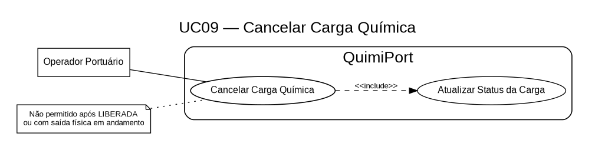

# UC09 — Cancelar Carga Química

## Objetivo

Encerrar definitivamente o ciclo de vida de uma carga por desistência do envio ou erro grave de cadastro.

## Ator envolvido

Operador Portuário.

## Entrada esperada

- identificador da carga;
- motivo do cancelamento.

## Saída esperada

Status alterado para `CANCELADA`.

## Principais regras de negócio

- Carga cancelada não pode ser liberada ou movimentada.
- Carga já liberada não pode ser cancelada nesta fase da modelagem.

## Possíveis erros ou exceções

- **E1:** tentativa de cancelar carga já liberada ou com saída física em andamento.
