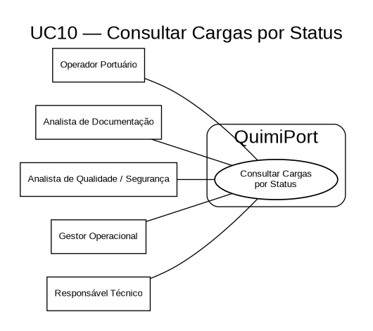

# UC10 — Consultar Cargas por Status

## Objetivo

Listar cargas filtrando pelo estado atual do ciclo de vida operacional.

## Atores envolvidos

- Operador Portuário;
- Analista de Documentação;
- Analista de Qualidade / Segurança;
- Gestor Operacional;
- Responsável Técnico.

## Entrada esperada

Parâmetro de filtro por `StatusCarga`.

Valores previstos na modelagem atual:

- `PENDENTE_DOCUMENTACAO`;
- `EM_INSPECAO`;
- `LIBERADA`;
- `BLOQUEADA`;
- `CANCELADA`.

## Saída esperada

Lista resumida das cargas correspondentes ao filtro.

## Principais regras de negócio

- Retornar somente cargas pertencentes ao escopo de visualização permitido ao ator.

## Possíveis erros ou exceções

- **E1:** status inválido ou inexistente.
