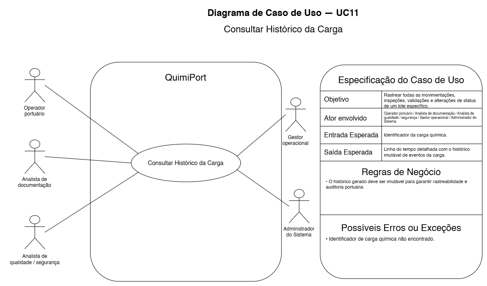

# UC11 — Consultar Histórico da Carga

## Objetivo

Rastrear movimentações, inspeções, validações e alterações de status de uma Carga Química.

## Atores envolvidos

- Operador Portuário;
- Analista de Documentação;
- Analista de Qualidade / Segurança;
- Gestor Operacional;
- Administrador do Sistema.

## Entrada esperada

Identificador da Carga Química.

## Saída esperada

Linha do tempo detalhada com histórico imutável de eventos.

## Principais regras de negócio

- O histórico deve ser imutável para garantir rastreabilidade e auditoria.

## Possíveis erros ou exceções

- **E1:** identificador de carga não encontrado.
