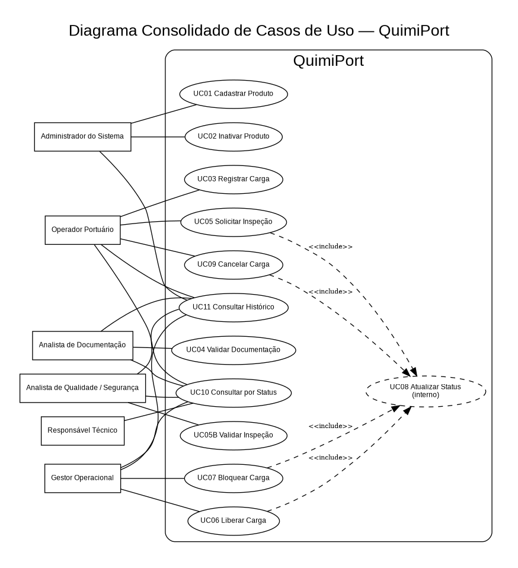

# Diagrama Consolidado de Casos de Uso

Este diagrama é complementar e apresenta uma visão geral dos atores e operações do QuimiPort.

A documentação e os diagramas individuais estão em [`../../02-casos-de-uso/`](../../02-casos-de-uso/).
