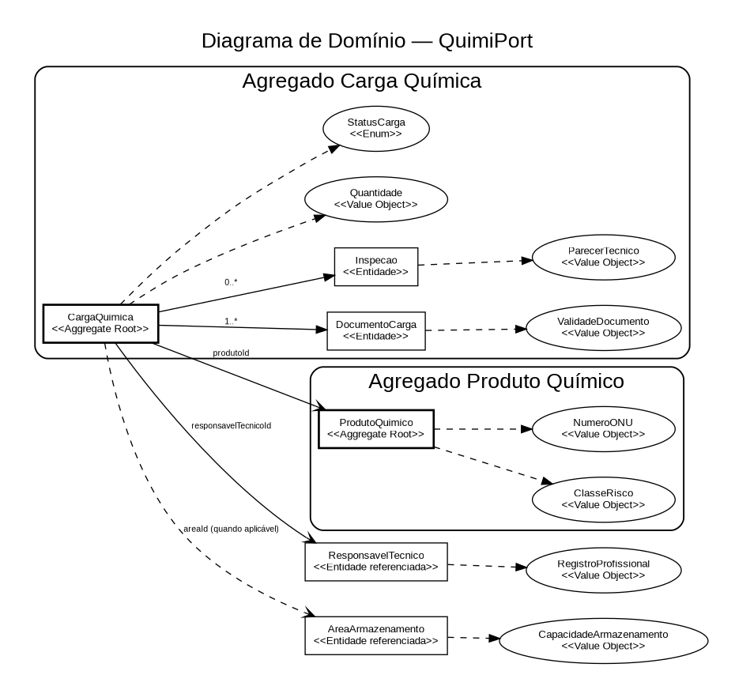

# Diagrama de Domínio

O diagrama evidencia as fronteiras dos agregados definidos para esta fase:

- **Carga Química** — Aggregate Root `CargaQuimica`;
- **Produto Químico** — Aggregate Root `ProdutoQuimico`.

`DocumentoCarga` e `Inspecao` permanecem dentro do agregado Carga Química. `ResponsavelTecnico` e `AreaArmazenamento` são entidades referenciadas na modelagem atual.

A justificativa completa está em [`../../01-dominio/agregados.md`](../../01-dominio/agregados.md).
