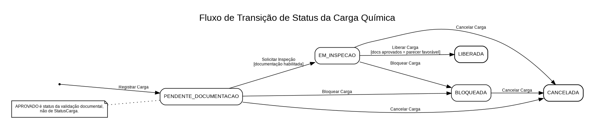

# Fluxo de Transição de Status da Carga Química

O fluxo abaixo representa exclusivamente os estados da **Carga Química** definidos pelos casos de uso atuais.

## Estados

| Status | Significado |
|---|---|
| `PENDENTE_DOCUMENTACAO` | Estado inicial após o registro da carga. |
| `EM_INSPECAO` | Carga com inspeção solicitada e em processo de avaliação. |
| `LIBERADA` | Carga autorizada pelo Gestor Operacional após atender às condições obrigatórias. |
| `BLOQUEADA` | Carga impedida de movimentação/liberação. |
| `CANCELADA` | Ciclo de vida encerrado por cancelamento. |

## Observação sobre a documentação

`APROVADO` é um status da **validação documental**, e não um valor de `StatusCarga`.

Por isso, `DOCUMENTACAO_APROVADA` não foi mantido como estado da máquina de estados da Carga Química. A documentação aprovada funciona como pré-condição para `Solicitar Inspeção` e para `Liberar Carga`.

## Transições modeladas

| Estado atual | Operação | Condição | Próximo estado |
|---|---|---|---|
| criação | Registrar Carga Química | cadastro válido | `PENDENTE_DOCUMENTACAO` |
| `PENDENTE_DOCUMENTACAO` | Solicitar Inspeção | documentação preliminar habilitada | `EM_INSPECAO` |
| `EM_INSPECAO` | Liberar Carga Química | documentação aprovada + parecer favorável | `LIBERADA` |
| `PENDENTE_DOCUMENTACAO` | Bloquear Carga Química | bloqueio válido | `BLOQUEADA` |
| `EM_INSPECAO` | Bloquear Carga Química | bloqueio válido | `BLOQUEADA` |
| `PENDENTE_DOCUMENTACAO` | Cancelar Carga Química | cancelamento válido | `CANCELADA` |
| `EM_INSPECAO` | Cancelar Carga Química | cancelamento válido | `CANCELADA` |
| `BLOQUEADA` | Cancelar Carga Química | cancelamento válido | `CANCELADA` |

## Transições não previstas nesta fase

- `LIBERADA → CANCELADA`
- `CANCELADA → qualquer outro estado`
- `BLOQUEADA → LIBERADA`
- desbloqueio/reabertura da carga

Caso essas operações sejam necessárias em uma fase futura, deverão ser introduzidas por novos casos de uso e novas regras de negócio.
